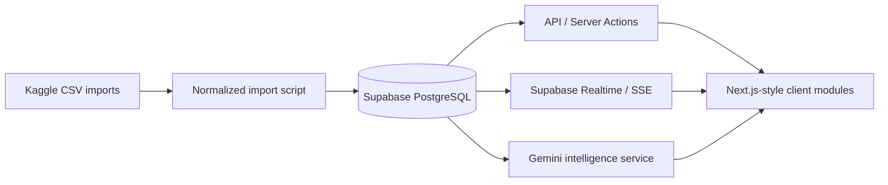

# TransitOps AI architecture

## Dataset mapping

| Source | Normalized destination | Used for |
| --- | --- | --- |
| `trucks.csv`, `drivers.csv`, `trips.csv`, `loads.csv`, `routes.csv` | vehicles, drivers, trips | dispatch and utilisation |
| `fuel_purchases.csv`, `maintenance_records.csv` | fuel_logs, expenses, maintenance_logs | cost and service history |
| `logistics_dataset_with_maintenance_required.csv` | ai_predictions | predictive maintenance |
| risk and supply-chain CSVs | route_risk, analytics_cache | route risk and delivery insight |

## Data flow

The local importer deliberately maps only required fields and avoids a direct raw CSV dump. The running demo uses a persistent local adapter and SSE. For deployment, replace that adapter with Supabase repositories, apply `database/schema.postgres.sql`, enable RLS, and store `SUPABASE_URL`, `SUPABASE_ANON_KEY`, and server-only keys in Vercel environment settings.
